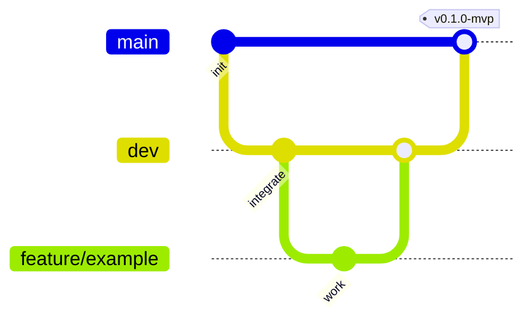

# Branch Strategy — ToyBox Blasters

**Task 012** — Git flow aligned with MVP → soft launch → production phases.

## Branch roles

| Branch | Purpose | Merge target | Lifetime |
|--------|---------|--------------|----------|
| `main` | Release-ready builds; tagged semver releases | — (protected) | Permanent |
| `dev` | Daily integration; feature branches merge here first | `main` (via PR + release) | Permanent |
| `feature/*` | One task or feature per branch | `dev` | Short-lived |
| `hotfix/*` | Urgent production fixes | `main` and `dev` | Short-lived |

## Naming conventions

```
feature/task-013-folder-structure
feature/runner-forward-movement
hotfix/crash-lane-end-null
```

Use lowercase kebab-case after the prefix. Include task id when working from phase prompts.

## Workflow



1. Branch from `dev`: `git checkout dev && git pull && git checkout -b feature/my-task`
2. Commit small, focused changes; run Unity validation menus before PR.
3. Open PR into `dev` — use `.github/pull_request_template.md`.
4. After QA on `dev`, open release PR `dev` → `main` and tag per [RELEASE_TAGS.md](./RELEASE_TAGS.md).

## Hotfixes

1. Branch from `main`: `git checkout main && git pull && git checkout -b hotfix/description`
2. Fix, PR to `main`, tag patch if needed.
3. Cherry-pick or merge back into `dev` so integration does not drift.

## Rules

- **Never force-push to `main`.**
- Do not commit `Library/`, secrets, or local `UserSettings/`.
- Prefer squash merge on feature → `dev` for clean history (team choice).

## Default branch

GitHub default branch should be **`main`**. Local setup:

```bash
git branch -M main
```

## Related

- [GITHUB_SETUP.md](./GITHUB_SETUP.md)
- [RELEASE_TAGS.md](./RELEASE_TAGS.md)
