# Core Gameplay Loop — ToyBox Blasters

**Task 005** — Phase 1 loop definition (documentation + config; no gameplay code).  
**Version:** 1.1 (indexed Task 010)  
**Config asset:** `Assets/_ToyBoxBlasters/ScriptableObjects/Config/CoreGameplayLoopConfig.asset`  
**Code defaults:** `CoreGameplayLoopDefaults.cs` (keep in sync with this doc)  
**Summary doc:** [GAMEPLAY_DESIGN.md](./GAMEPLAY_DESIGN.md)

Aligned with **PRD.md**, **RELEASE_SCOPE.md** (Task 002), and **AUDIENCE_AND_PERSONAS** (Task 003 via `AudiencePersonaDefaults`).

---

## Global rules (locked for MVP design)

| Rule | Value |
|------|--------|
| **World** | World 1 — **Bedroom Floor** |
| **Genre** | Hybrid-casual squad shooter runner |
| **Fail condition (MVP)** | **Squad wiped** — squad count reaches 0 |
| **Fail condition (future)** | Optional level timer via `LevelTimingConfig` — not MVP |
| **Partial coins on fail** | **50%** of in-run pickups bank to meta wallet |
| **Run length** | **2–4 minutes** |
| **Session length** | **8–15 minutes**, typically **1–3 runs** |
| **Primary currency** | Coins (meta upgrades) — see **[ECONOMY_PHILOSOPHY.md](./ECONOMY_PHILOSOPHY.md)** |
| **Secondary currency** | Gems — optional **soft launch+** (not required V1 progress) |
| **Event currency** | **Bedroom Tokens** — production LiveOps; expires after event |
| **MVP monetization** | None playable; ad/cosmetic/LiveOps **documented + `EconomyPhilosophyConfig`** |

---

## Loop stack overview

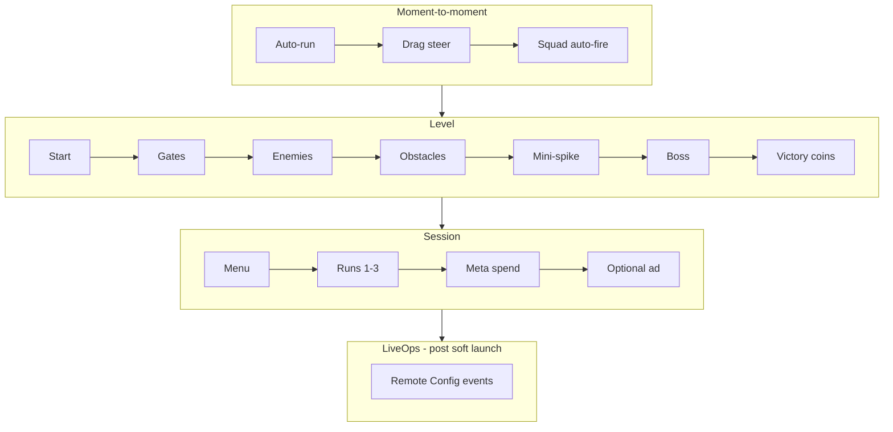

---

## 1. Moment-to-moment loop

**Diagram id:** `loop_moment`  
**Phase:** MVP  
**Personas:** Casual Casey, Progression Pat

Auto-run forward, drag steer, squad auto-fire, dodge/spread readability, +/- gate legibility at portrait distance.

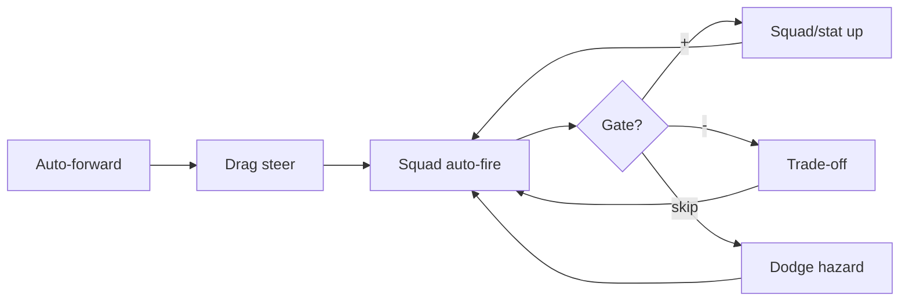

| Beat | Notes |
|------|--------|
| Auto-forward | Runner speed from `RunnerSpeedConfig` |
| Steer | Clamp to lane width; no manual fire button |
| Auto-fire | Target nearest threat in arc |
| Gates | Color + icon + number; positive/negative |
| Dodge | Slime telegraphs; squad spread VFX |

**Tuning keys:** `SquadConfig`, `WeaponToyConfig`, `GateDefinitionConfig`, `RunnerSpeedConfig`

---

## 2. Level loop

**Diagram id:** `loop_level`  
**Phase:** MVP (1 slice); soft launch 5–10 levels

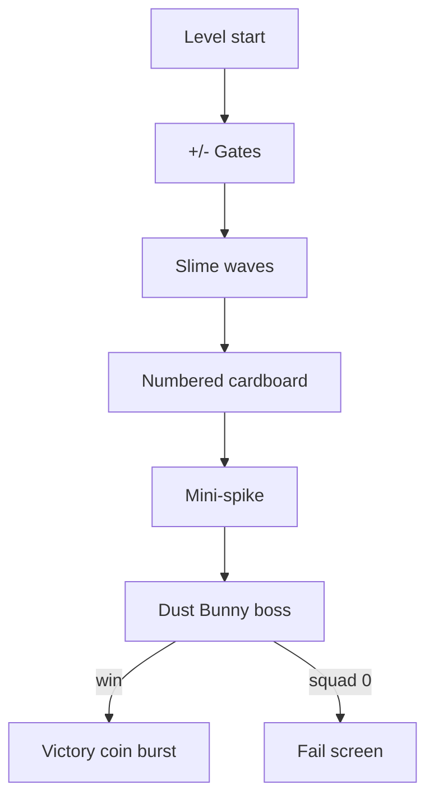

| Beat | Placeholder |
|------|-------------|
| Enemies | `PFB_SlimeEnemy_Placeholder` |
| Obstacles | `PFB_CardboardBox_Placeholder` (HP number) |
| Boss | `PFB_DustBunnyBoss_Placeholder` |
| Gates | `PFB_GatePositive/Negative_Placeholder` |

**Tuning keys:** `LevelSequenceConfig`, `ObstacleHpConfig`, `BossPatternConfig`, `CoinRewardConfig`

---

## 3. Session loop

**Diagram id:** `loop_session`  
**Phase:** MVP

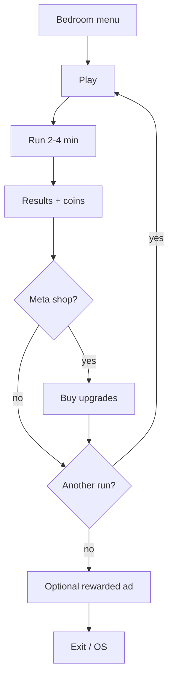

**Targets:** 1–3 runs, 8–15 min total (Task 003 audience).

---

## 4. Long-term progression loop

**Diagram id:** `loop_longterm`  
**Phase:** MVP (3 upgrades); worlds post-V1

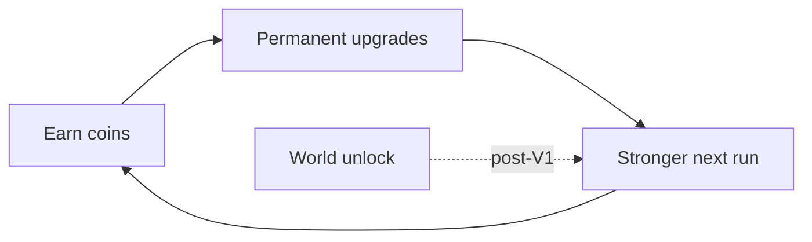

| MVP upgrades | Effect |
|--------------|--------|
| Squad damage | Faster obstacle/boss kills |
| Fire rate | More projectiles |
| Starting squad | More toys at spawn |

**Post-V1:** World 2+ on roadmap (`RELEASE_SCOPE.md`).

---

## 5. Reward timing loop

**Diagram id:** `loop_reward`  
**Phase:** MVP juice; daily login soft launch+

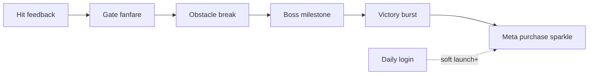

Stagger rewards to avoid slot-machine fatigue; each beat has SFX/VFX hooks in `JuiceConfig`.

---

## 6. Failure / retry loop

**Diagram id:** `loop_failure`  
**Phase:** MVP

**Chosen fail rule:** Squad count = 0 (all members destroyed). Timer fail deferred.

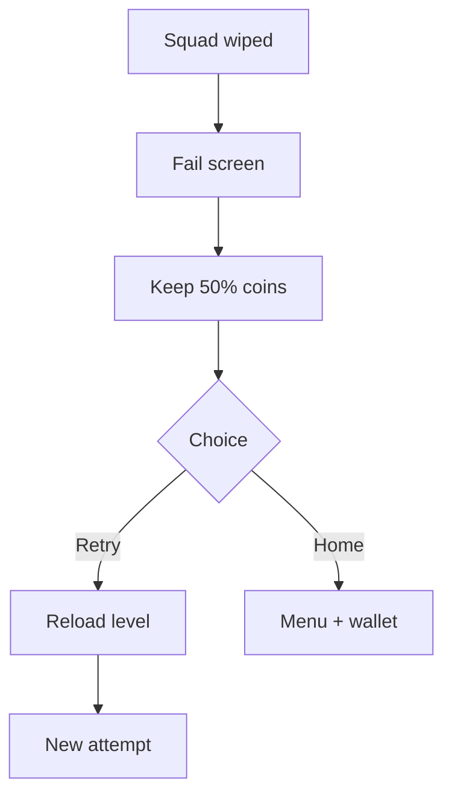

| Design | Value |
|--------|--------|
| Partial retention | **50%** of in-run coins |
| Revive | Rewarded ad only (soft launch+); not MVP |

---

## 7. Upgrade loop

**Diagram id:** `loop_upgrade`  
**Phase:** MVP

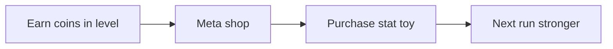

No pay-to-win on core stats (audience rule).

---

## 8. Ad reward loop

**Diagram id:** `loop_ad`  
**Phase:** **Designed only** (MVP interfaces)

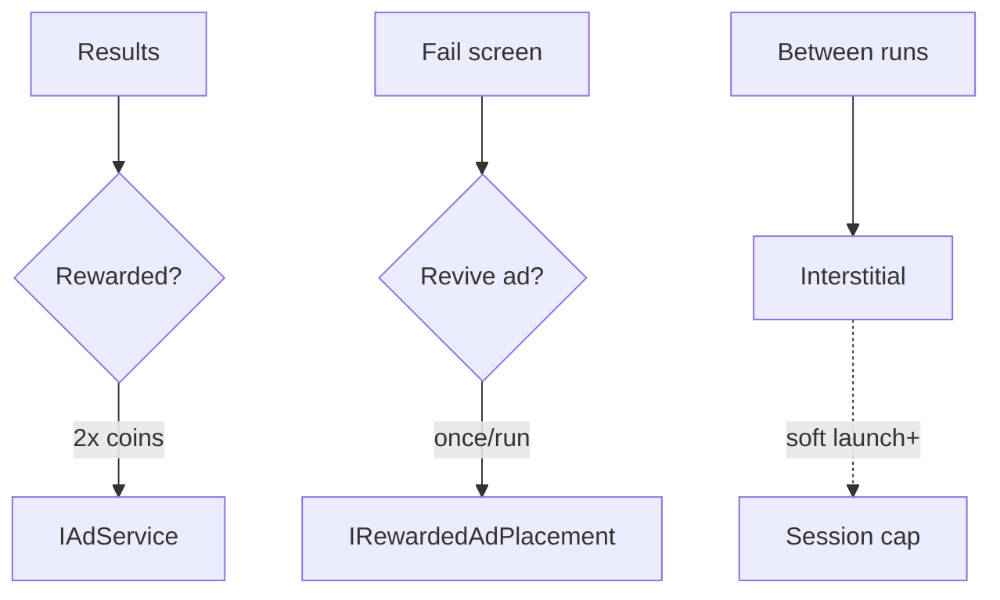

| Placement | MVP | Soft launch+ |
|-----------|-----|--------------|
| 2× coins | Interface | Implement |
| Revive | Interface | Implement |
| Interstitial | Documented | Between runs only |

---

## 9. Cosmetic loop

**Diagram id:** `loop_cosmetic`  
**Phase:** **Designed only** (production scope)

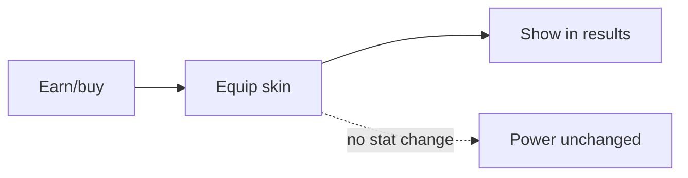

Hero / squad / trail skins — **zero gameplay power**. Collector Chris primary persona.

---

## 10. LiveOps loop

**Diagram id:** `loop_liveops`  
**Phase:** **Designed only** (post-soft-launch)

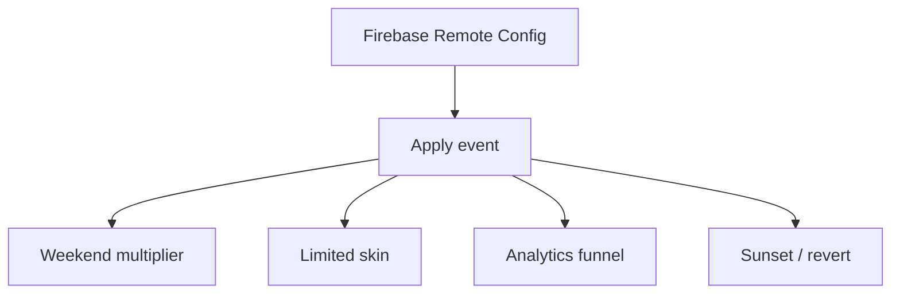

Hooks: `IRemoteConfigService`, `IAnalyticsService`, `LiveOpsEventConfig`.

---

## Task 005 review — pass/fail

| # | Subtask | Doc | Config | Validator | Review |
|---|---------|-----|--------|-----------|--------|
| 1 | Moment-to-moment | Pass | Pass | Pass | **Pass** |
| 2 | Level loop | Pass | Pass | Pass | **Pass** |
| 3 | Session loop | Pass | Pass | Pass | **Pass** |
| 4 | Long-term progression | Pass | Pass | Pass | **Pass** |
| 5 | Reward timing | Pass | Pass | Pass | **Pass** |
| 6 | Failure/retry | Pass | Pass | Pass | **Pass** |
| 7 | Upgrade loop | Pass | Pass | Pass | **Pass** |
| 8 | Ad reward | Pass | Pass | Pass | **Pass** (designed only) |
| 9 | Cosmetic | Pass | Pass | Pass | **Pass** (designed only) |
| 10 | LiveOps | Pass | Pass | Pass | **Pass** (designed only) |

**Overall Task 005:** **PASS** — all ten loops documented and encoded; compile-safe; no gameplay implementation.

---

## Next task (Phase 2)

**Vertical slice:** auto-forward runner + drag steering + one gate + auto-fire vs one slime + one numbered obstacle + lane end under 3 minutes (`ReleaseScopeDefaults.FirstPlayablePrototypeGoal`).
