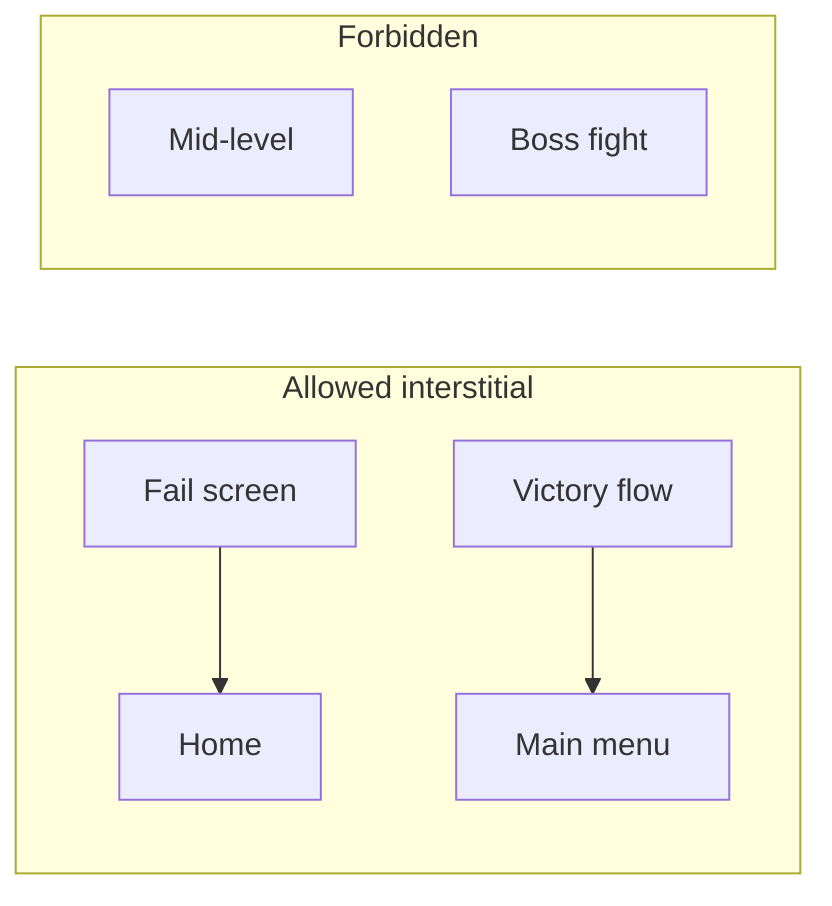

# Monetization Strategy — ToyBox Blasters

**Task 007** — Phase 1 definition (docs + config; **no live ad/IAP SDK** in repo).  
**Config asset:** `Assets/_ToyBoxBlasters/ScriptableObjects/Config/MonetizationStrategyConfig.asset`  
**Code defaults:** `MonetizationStrategyDefaults.cs`  
**Validate in Unity:** **ToyBox Blasters → Validate Monetization Strategy**

**Related:** `PROJECT_DOCS/RELEASE_SCOPE.md`, `AUDIENCE_AND_PERSONAS.md`, `GAMEPLAY_DESIGN.md`, `CORE_GAMEPLAY_LOOP.md`.  
**Economy alignment:** When `ECONOMY_PHILOSOPHY.md` (Task 006) lands, keep sources/sinks in sync with this doc and `MonetizationStrategyConfig.economyAlignmentNote`.

---

## 1. Principles

| Principle | Rule |
|-----------|------|
| Audience | General hybrid-casual (18–34 core); family-friendly toy visuals |
| Pressure | Low in MVP; interstitials **between runs only** from soft launch+ |
| Power | **No pay-to-win**; no PvP in V1 |
| Gems | Cosmetics / convenience — **never sole power progression in V1** |
| MVP | **No monetization SDK** — interfaces + ScriptableObject catalog only |
| Phase 2+ | AdMob / AppLovin (or mediation), Unity IAP / native store — soft launch+ |

---

## 2. Placement matrix

### 2.1 Rewarded (opt-in)

| ID | Surface | V1 | Economy link |
|----|---------|----|----------------|
| `end_run_2x_coins` | Results screen — **2× run coins** | Yes | Source: `coin_run_reward` |
| `revive_once_per_run` | Fail point — **one revive per run** | Yes | Continue run vs lose progress |
| `daily_bonus_chest` | Hub — **once per day** | Yes | Source: `daily_login_reward` |
| `gate_preview_reroll` | Pre-gate UI | **Post-V1** | Sink: gate RNG quality |

### 2.2 Interstitial (system)

| ID | Surface | V1 | Notes |
|----|---------|----|-------|
| `fail_screen_continue_home` | Fail → Home / Continue | Soft launch+ | After fail flow completes |
| `victory_return_to_menu` | Victory → Main menu | Soft launch+ | After victory flow completes |

### 2.3 Forbidden interstitial contexts

- **Never** mid-level / during combat
- **Never** during boss fight or boss intro
- **Never** on first **3** lifetime runs (new-player grace)
- Respect **90–120 s** minimum between interstitials and per-session cap

---

## 3. IAP SKU table (placeholder store prices)

| SKU ID | Type | Price (USD) | V1 | Grants / notes |
|--------|------|-------------|-----|----------------|
| `iap_no_ads` | No-ads | **$4.99** | Yes | Removes interstitials; rewarded optional; **restore purchases** |
| `iap_starter_pack` | Starter | **$2.99** | Yes | 2,500 coins + 120 gems + exclusive toy skin; **first 72h** offer |
| `iap_coin_small` | Coins | $0.99 | Yes | 800 coins (~10% bonus vs grind) |
| `iap_coin_medium` | Coins | $4.99 | Yes | 5,000 coins (~15% bonus) |
| `iap_coin_large` | Coins | $9.99 | Yes | 12,000 coins (~25% bonus) |
| `iap_gem_tier1` | Gems | $0.99 | Yes | 40 gems — cosmetics |
| `iap_gem_tier2` | Gems | $4.99 | Yes | 250 gems |
| `iap_gem_tier3` | Gems | $9.99 | Yes | 550 gems |
| `iap_gem_tier4` | Gems | $19.99 | Yes | 1,200 gems |
| `iap_cosmetic_hero_trail` | Bundle | $4.99 | Yes | Hero skin + trail |
| `iap_cosmetic_squad_colors` | Bundle | $4.99 | Yes | Squad color variants |
| `iap_cosmetic_bedroom_theme` | Bundle | $9.99 | Yes | Bedroom UI/ambient theme (production target) |
| `iap_battle_pass_season` | Battle pass | $7.99 | **No (doc)** | See §8 |

Store product IDs and regional pricing are set at SDK integration (Phase 2).

---

## 4. No-ads & starter pack

### No-ads ($4.99)

- Suppresses **all interstitial** placements for the account/device (persist entitlement).
- **Rewarded ads remain optional** — never required to progress.
- **Restore purchases** on iOS/Android with clear settings entry.
- **Family-friendly disclosure:** explain ads/IAP in onboarding or settings; no dark patterns.

### Starter pack ($2.99)

- One-time purchase: coins + gems + **exclusive cosmetic** toy skin (no stats).
- Shown only in **first 72 hours** after install (configurable via Remote Config later).
- Does not block core progression if skipped.

---

## 5. Coin & gem packs

**Coin ladder:** $0.99 / $4.99 / $9.99 with **~10–25% bonus** vs time-equivalent grinding (tune with economy sim).  
**Gem ladder:** $0.99 – $19.99 for **cosmetic shop** and convenience — align sinks in Task 006 (`cosmetic_shop`, theme unlocks).

**V1 guardrail:** Gems must not be the only path to meaningful permanent power (meta upgrades remain coin-primary).

---

## 6. Cosmetic bundles

| Bundle | Price | Contents |
|--------|-------|----------|
| Hero + trail | $4.99 – $9.99 band | Hero skin + VFX trail |
| Squad colors | $4.99 | Squad tint variants |
| Bedroom theme | $9.99 | Hub/run UI theme pack (production polish) |

All bundles are **cosmetic-only** — no damage, fire rate, or squad size stats.

---

## 7. Battle pass (later — V1 document only)

- **Soft launch+** when retention supports seasons.
- Season length: **4–6 weeks**.
- **Free + premium** tracks; rewards = cosmetics + currency (no exclusive power).
- SKU `iap_battle_pass_season` exists in config with `enabledInV1 = false`.
- See `RELEASE_SCOPE.md` post-launch roadmap.

---

## 8. Ad frequency rules

| Rule | Default | Remote Config |
|------|---------|---------------|
| Min time between interstitials | **90 s** (band up to 120 s) | Yes |
| Max interstitials / session | **4** | Yes |
| Max rewarded / day | **6** (band 5–8) | Yes |
| Rewarded cooldown | **30 s** between offers | Yes |
| New player grace (no interstitial) | **First 3 runs** | Yes |
| Mid-level / boss interstitial | **Blocked** | Policy flag |

Implementation: `AdFrequencyRules` on `MonetizationStrategyConfig`; enforce via `IAdsPlacementPolicy` stub → live SDK adapter Phase 2.

---

## 9. Economy cross-links (sources & sinks)

| Flow | Source | Sink |
|------|--------|------|
| Run complete | `coin_run_reward` | Meta upgrades (`meta_upgrades_x3`) |
| Fail partial | 50% coins retained | — |
| Rewarded 2× | Multiplier on run coins | Player time / ad impression |
| Daily chest | `daily_login_reward` | — |
| Coin IAP | `iap_coin_*` | Upgrades, future cosmetics |
| Gem IAP | `iap_gem_*` | Cosmetic shop, themes |
| Starter / bundles | IAP grants | Inventory / theme slots |

When **Task 006** `ECONOMY_PHILOSOPHY.md` is added, mirror these ids there and run joint validation.

---

## 10. Monetization KPIs (baselines TBD)

| Metric ID | Purpose | Guardrail |
|-----------|---------|-----------|
| `arpdau` | Blended ad + IAP per DAU | No retention cliff for ARPDAU spikes |
| `ad_ltv` | Cohort ad revenue D7/D30 | Don’t chase eCPM with mid-run ads |
| `iap_conversion` | % DAU with any IAP (7d) | Starter pack vs no-ads balance |
| `rewarded_opt_in` | % eligible surfaces completed | Tune 2× coins copy/reward if low |
| `no_ads_attach` | % owners of no-ads | Zero interstitials for owners |
| `retention_monetization` | D1/D7 vs monetization intensity | **D1 ≤3pp drop** vs low-mon control |

Set numeric targets after **soft launch** cohort (Firebase Analytics + BigQuery export).

---

## 11. Phase rollout

| Phase | Monetization |
|-------|----------------|
| **MVP** | None (per `RELEASE_SCOPE.md`) |
| **Soft launch** | Interstitial **interface** + placeholder; Remote Config hooks |
| **Production** | Live rewarded + IAP shop + no-ads + packs |
| **Post-V1** | Battle pass, gate reroll rewarded, mediation tuning |

---

## 12. Code map

| File | Role |
|------|------|
| `MonetizationStrategyConfig` | ScriptableObject source of truth |
| `MonetizationStrategyDefaults` | Canonical values (sync with this doc) |
| `MonetizationStrategyValidator` | Editor/CI validation |
| `IAdsPlacementPolicy` / `ConfigAdsPlacementPolicy` | Ad policy stub |
| `IIapCatalog` / `ConfigIapCatalog` | IAP catalog stub |
| `MonetizationStrategyBootstrap` | Optional dev Play-mode log |

---

## 13. Review checklist (Task 007)

- [x] All 10 subtasks documented
- [x] Placement matrix + forbidden contexts
- [x] SKU table with placeholder prices
- [x] Frequency rules + KPIs
- [x] ScriptableObject stack + Editor validate menu
- [x] No SDK in repo (Phase 2)
- [ ] `MonetizationStrategyConfig.asset` created locally via Editor menu
- [ ] Joint validation with `ECONOMY_PHILOSOPHY.md` when Task 006 completes
