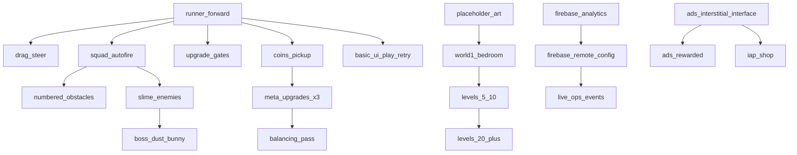

# Release Scope — ToyBox Blasters

**Task 002** — MVP, soft launch, and production/global scope.  
**Config asset:** `Assets/_ToyBoxBlasters/ScriptableObjects/Config/ReleaseScopeConfig.asset`  
**Code defaults:** `ReleaseScopeDefaults.cs` (keep in sync with this doc)

---

## 1. MVP scope

Minimum shippable **vertical slice** for internal playtests and store submission readiness review.

| Area | MVP includes |
|------|----------------|
| **World** | 1 world — **Bedroom Floor** (3–5 short levels or 1 endless segment + boss) |
| **Core loop** | Auto-runner, drag steer, squad auto-fire |
| **Mechanics** | +/- upgrade gates, numbered breakable obstacles |
| **Enemies** | Slime enemy type, **1 boss** (Dust Bunny) |
| **Economy** | Coin pickups, **3 permanent meta upgrades** (e.g. damage, fire rate, starting squad) |
| **UI** | Play, retry, simple HUD (coins / squad count) |
| **Art/audio** | Placeholder art only; minimal SFX optional |
| **Backend** | Local save optional; no live Firebase required for MVP |
| **Monetization** | None in MVP |

---

## 2. Soft launch scope

Limited regional or test-track release to validate retention, stability, and tuning.

| Area | Soft launch adds |
|------|------------------|
| **Content** | **5–10** tuned levels in World 1 |
| **Backend** | Firebase **Analytics** + **Remote Config** |
| **Quality** | Crash reporting, balancing pass, performance pass on mid devices |
| **Ads** | **Interstitial** ad interface + placeholder implementation (no paid SDK required in repo) |
| **Distribution** | iOS TestFlight, Android Internal Testing builds |
| **Live ops** | Remote tunable gate/obstacle/boss parameters |

---

## 3. Production / global launch scope

Full commercial release target.

| Area | Production adds |
|------|-----------------|
| **Content** | **20+** levels, additional worlds post-V1 on roadmap |
| **Monetization** | IAP shop (remove ads, currency packs), **rewarded** ads |
| **Live ops** | Scheduled events, offer hooks via Remote Config |
| **Polish** | Production VFX, music, SFX, juice |
| **Localization** | English + **1** additional language |
| **Store** | ASO assets, store listing polish, ratings prompt flow |
| **Growth** | Retention tuning, UA-ready build metrics, ROAS targets (TBD) |

---

## 4. Must-have vs nice-to-have

| Priority | Meaning |
|----------|---------|
| **P0** | Blocker for the target release phase; cannot ship without it |
| **P1** | Strongly desired; can ship with documented cut only if schedule critical |
| **P2** | Nice-to-have; cut first under pressure |

**Must-have (`mustHave = true`):** Required for that phase’s definition of “done.”  
**Nice-to-have (`mustHave = false`):** Improves quality but not blocking.

See `ReleaseScopeConfig` feature table in Editor for per-feature flags.

---

## 5. Not included in V1 (global launch)

- PvP or social features
- Guilds / clans / chat
- Multiple live-op event frameworks at launch
- More than **2** languages at global launch
- Console or PC ports
- User-generated content
- Deep narrative / cutscene campaign
- Second world at global launch (roadmap item)
- Real-money gambling-style mechanics
- Account linking beyond basic Firebase Auth (deferred)

---

## 6. Post-launch additions (roadmap)

- World 2+ (e.g. Kitchen Counter, Backyard)
- Battle pass / season pass
- Daily quests and streak systems
- Cosmetic squad skins (IAP)
- Leaderboards / async ghosts
- Additional boss modifiers and elite enemies
- Cloud save cross-device
- Push notifications for retention
- A/B experiment framework beyond Remote Config basics
- Influencer / referral campaigns

---

## 7. Feature priority levels

| Level | Usage |
|-------|--------|
| P0 | Core loop, crash-free build, store compliance |
| P1 | Monetization, analytics, content volume for soft launch |
| P2 | Polish, extra languages, advanced live ops |

---

## 8. Feature dependencies (summary)

Full dependency lists are on each `FeatureScopeEntry` in `ReleaseScopeConfig`.

---

## 9. First playable prototype goal

**Single vertical-slice level** (internal milestone, before full MVP):

- Player **runs** forward and **steers** left/right
- Pass **1** upgrade gate (+ squad or stat)
- **Auto-fire** hits at least **1** slime enemy
- Destroy **1** numbered cardboard obstacle
- Reach **end** of short lane (no full boss required for first playable)
- **Placeholder art only**
- Playable in **under 3 minutes**
- No meta menu required (retry restarts slice)

---

## 10. Full production success criteria

| Metric | Target | Notes |
|--------|--------|-------|
| D1 retention | **≥ 25%** | TBD refine after soft launch |
| Crash-free sessions | **≥ 99.5%** | Firebase Crashlytics |
| Avg session length | **2–4 min** | Aligns with hybrid-casual |
| Store rating | **≥ 4.2** | iOS + Android combined |
| UA ROAS | **TBD** | Set after soft launch CPI/LTV data |
| Level completion (W1) | **≥ 60%** reach boss on first 5 levels | Tuning metric |
| Load time (cold) | **< 5 s** on mid-tier Android | Performance gate |

---

## Cross-links

- Product identity: `PROJECT_DOCS/PRD.md`
- Gameplay loop: `PROJECT_DOCS/GAMEPLAY_DESIGN.md`
- Tech stack: `PROJECT_DOCS/TECH_DESIGN.md`
- Backlog tracking: `PROJECT_DOCS/FEATURE_BACKLOG.md`
