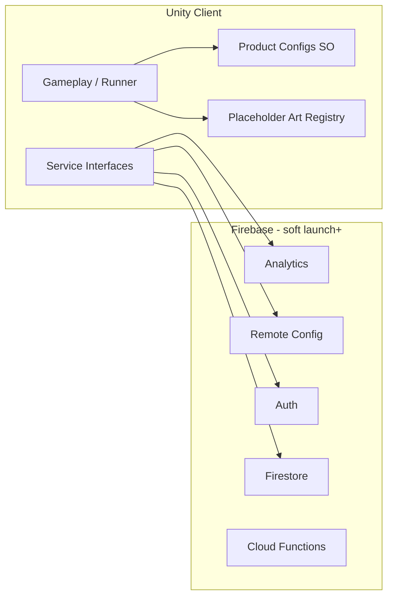

# Technical Architecture — ToyBox Blasters

**Version:** 1.0 (Task 010)  
**Status:** Phase 1 architecture lock

## See also

- **[TECH_DESIGN.md](./TECH_DESIGN.md)** — stack, Firebase table, module layout (Task 001 baseline)
- **[TECH_DECISIONS.md](./TECH_DECISIONS.md)** — ADRs TD-001 through TD-020+
- **[ANALYTICS_SPEC.md](./ANALYTICS_SPEC.md)** — event taxonomy
- `Assets/_ToyBoxBlasters/ScriptableObjects/Config/FIREBASE_SETUP.placeholder.md`

---

## System context

---

## Repository layout

| Path | Purpose |
|------|---------|
| `Assets/_ToyBoxBlasters/Scripts/` | Product + gameplay C# (`ToyBoxBlasters.Scripts`) |
| `Assets/_ToyBoxBlasters/Runtime/` | Placeholder art runtime (`ToyBoxBlasters.Runtime`) |
| `Assets/_ToyBoxBlasters/Editor/` | Setup, validation menus (`ToyBoxBlasters.Editor`) |
| `Assets/_ToyBoxBlasters/ScriptableObjects/Config/` | Locked product configs |
| `Assets/PlaceholderPack/` | Canonical SVG sources |
| `PROJECT_DOCS/` | Master documentation ([README.md](./README.md)) |
| `00_MASTER/` | Cursor agent instructions |

---

## Product configuration layer

ScriptableObjects + static defaults + Editor validators (Tasks 001–010):

| Config | Validator menu |
|--------|----------------|
| GameConceptConfig | Validate Game Concept |
| ReleaseScopeConfig | Validate Release Scope |
| TargetAudienceConfig | Validate Target Audience |
| CompetitiveResearchConfig | Validate Competitive Research |
| CoreGameplayLoopConfig | Validate Core Gameplay Loop |
| EconomyPhilosophyConfig | Validate Economy Philosophy |
| DocumentationManifestConfig | Validate Documentation System |

---

## Backend interfaces (interface-first)

| Capability | Interface | Default impl path |
|------------|-----------|-------------------|
| Analytics | `IAnalyticsService` | Firebase Analytics |
| Remote tuning | `IRemoteConfigService` | Firebase Remote Config |
| Auth | `IAuthService` | Firebase Auth |
| Player data | `IPlayerProfileRepository` | Firestore |
| Backend preference | `IBackendPreference` | `FirebaseBackendPreference` |

**MVP:** interfaces + docs only; no production credentials in repo.

---

## Documentation system (Task 010)

- **Index:** [README.md](./README.md)
- **Manifest:** `DocumentationManifestConfig` lists paths, required flags, task IDs
- **Editor:** **ToyBox Blasters → Documentation → Validate Documentation System**

---

## Build & platform

- Unity **2022.3 LTS**, C#, portrait iOS/Android
- URP when render pipeline added; primitives OK for prototype
- Compile-safe after every task; no gameplay scene required until Phase 2
